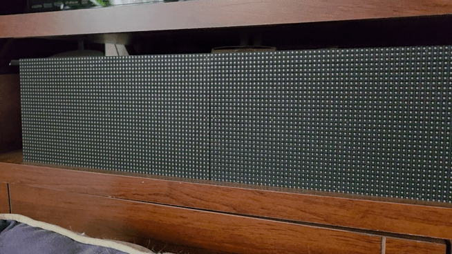

# Newscroller - Raspberry Pi RGB Matrix Display

Python project for driving an **Adafruit RGB Matrix Bonnet** connected to a **Raspberry Pi Zero W**.

---

## Features

The project provides a python script driving an LED RGB matrix display for scrolling news headlines from a defined list of RSS sources.

- Drive RGB LED matrix display using Python
- Runs as a Linux system service
- Designed for headless Raspberry Pi operation
- Takes headlines from news RSS feeds.

### RGB Matrix Display - Newscroller



---

## Hardware

### Required Components

| Component      | Description                     |
| -------------- | ------------------------------- |
| Raspberry Pi   | Raspberry Pi Zero W           |
| LED Controller | [Adafruit RGB Matrix Bonnet](https://www.adafruit.com/product/3211)|
| Display        | [64x32 RGB LED Matrix Panel (2x)](https://www.adafruit.com/product/2278)|
| Power Supply   | 5V power supply sized for panel |
| microSD Card   | Raspberry Pi OS                 |

### Prerequisite
Raspberry Pi running Raspberry PI OS with ssh access and also connected to internet.

See [Getting started](https://www.raspberrypi.com/documentation/computers/getting-started.html).

### Hardware Setup

Physically connect matrix bonnet and matrix panels to the raspberry pi.

See [Matrix setup](https://learn.adafruit.com/adafruit-rgb-matrix-bonnet-for-raspberry-pi/matrix-setup).

---


## Software Requirements

- Raspberry Pi OS
- Python 3.x
- Virtual environment (recommended)
- Adafruit RGB Matrix library

Check Python version:

```bash
python3 --version
```

## Installation

Create python virtual enviroment and activate:
```
sudo apt install python3-venv python3-pip
python3 -m venv .venv
source .venv/bin/activate
```

Install python modules ([requirements.txt](requirements.txt)):
```
pip install -r requirements.txt
```

Install Matrix library (see instructions):

https://learn.adafruit.com/adafruit-rgb-matrix-bonnet-for-raspberry-pi/install-using-script

## Usage
Python script: [newscroller.py](newscroller.py)

Update script variables:
+ point to correct file locations for `scroller` executable (i.e.: *scrolling-text-example*) and `fontpath`
+ update the list of `newsurls` for RSS sources
+ update `filter_keywords` using regex syntax to remove unwanted headline strings
+ update `replacement_text` with text to replace headlines with filtered keywords


## Service
Create systemd service.
```
sudo vi /etc/systemd/system/newscroller.service
```

Example file:

```
[Unit]
Description=RGB Matrix Newscroller
After=network.target

[Service]
Type=simple
WorkingDirectory=/home/pi/projects/led-matrix
ExecStart=/home/pi/.venv/bin/python /home/pi/projects/led-matrix/newscroller.py
Restart=on-abort
User=pi

[Install]
WantedBy=multi-user.target
```
Load the newscroller service:
```
sudo systemctl daemon-reload
sudo systemctl enable newscroller
sudo systemctl start newscroller
sudo systemctl status newscroller
```

## Reference

[Python Usage](https://learn.adafruit.com/adafruit-rgb-matrix-bonnet-for-raspberry-pi/python-usage)
